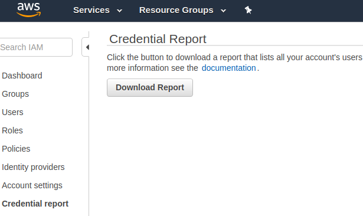

# Remove Inactive AWS-IAM Users
A script to remove inactive AWS-IAM Users

## Pre-requisite
 - Install AWS-CLI `pip install awscli`
 - Login to AWS-CLI with a user having admin access for AWS so that it has the access to delete the inactive users 

## How to use it?
1. Download Credential Report from AWS Console under the IAM Menu and save it in the same folder as that of the script 
2. Update value of FILE in the script with Credential Report name
3. Update the value of LIMIT_PERIOD. **If user has not used access key for days greater than or equal to this value then the user will be deleted**
4. Run the script

## Note:
At the time of creation of the script, AWS generates Credential Report as a CSV file with following fields in given order. If the format changes, then create an issue and I will update the script accordingly.
```user
arn
user_creation_time
password_enabled
password_last_used
password_last_changed
password_next_rotation
mfa_active
access_key_1_active
access_key_1_last_rotated
access_key_1_last_used_date
access_key_1_last_used_region
access_key_1_last_used_service
access_key_2_active
access_key_2_last_rotated
access_key_2_last_used_date
access_key_2_last_used_region
access_key_2_last_used_service
cert_1_active
cert_1_last_rotated
cert_2_active
cert_2_last_rotated
```
